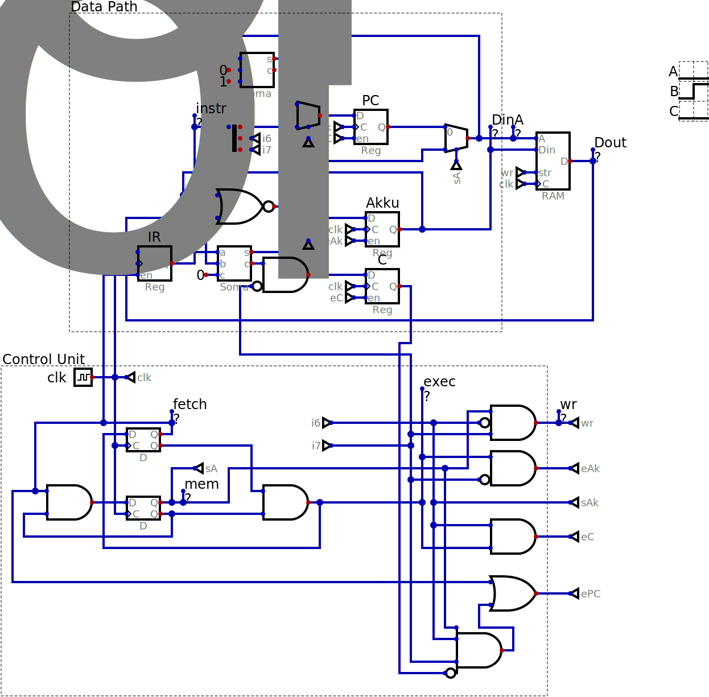
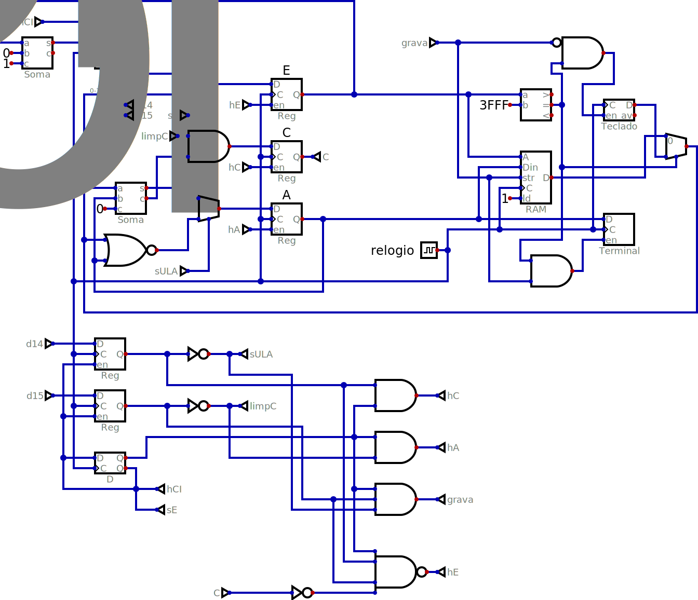

# MCPU

This simple 8 bit processor by Tim Böscke only implements 4 instructions and
can address 64 bytes of memory. More information as well as VHDL and Verilog
implementations can be found in (https://github.com/cpldcpu/MCPU).

The instructions are:

| assembler | binary | operation |
|-----------|--------|-----------|
| NOR addr  | 00?????? | Akku = ~(Akku | mem[addr]) |
| ADD addr  | 01?????? | Akku = Akku + mem[addr] |
| STA addr  | 10?????? | mem[addr] = Akku |
| JCC addr  | 11?????? | if carry == 0 then PC = addr; carry = 0 |

These instructions are defined as GNU AS macros in *mcpu.inc* so
an assembly program such as *gcd.S* which calculates the greatest
commond denominator can be assembled using the x86 version of as:

    as -a -o gcd.o gcd.S

where *gcd.S* includes *mcpu.inc*. The "-a" option creates a listing
on the terminal while "-o" selects a name different than a.out. The
next step is to convert the binary into a format that can be used
by the Digital simulator, such as Intel Hex:

    objcopy -S -O ihex gcd.o gcd.hex

The project *mcpu_bram.dig* uses an FPGA block RAM which complicates
the timing. Each instruction takes three clock cycles: fetch (F),
memory (M) and execute (E). The address must be supplied in the
previous clock cycle:

| signal | F | M | E | F | M | E | F | M | E |
|--------|---|---|---|---|---|---|---|---|---|
| Address| X |IR |PC | X |IR |PC | X |IR |PC |
| DataOut| I | X | D | I | X | D | I | X | D |

Most low end RAM chips are asynchronous and some FPGAs can disable the
internal registers of their BRAMs to have this behavior. Eliminating
the pipelining will reduce the maximum possible clock speed but it
will allow a version of the MCPU that only needs two clock cycles
per instruction:

| signal | F | E | F | E | F | E |
|--------|---|---|---|---|---|---|
| Address| PC | IR | PC | IR | PC | IR |
| DataOut| ...I | ...D | ...I | ...D | ...I | ...D |

The right part is the external system with 32KB (16K words of 16 bits each) of
regular RAM with a terminal mapped at address 0x3FFF for writes and a keyboard
at the same address for reads. The top of the left side of the figure is the
datapath while the bottom is the control unit. Due to the differences in the
timing of the external memory the program counter and address registers have
exchanged places. The control unit is slightly simpler in this scheme.

The design was trivially expanded to have 16 bit data and 14 bit addresses, though
that added a few complications to *mcpu16.inc* due to the mixing of byte and word
addresses.

The program *testTerminal.S* writes "Hello world!" to the terminal and requires
self modifying code to step through the string.

The program *term2048.S* is a text version of the puzzle game 2048. It also tests
the i/o circuit that combines keyboard, terminal and a counter. For every screen
it draws it shows how many clock cycle it took to do so.
