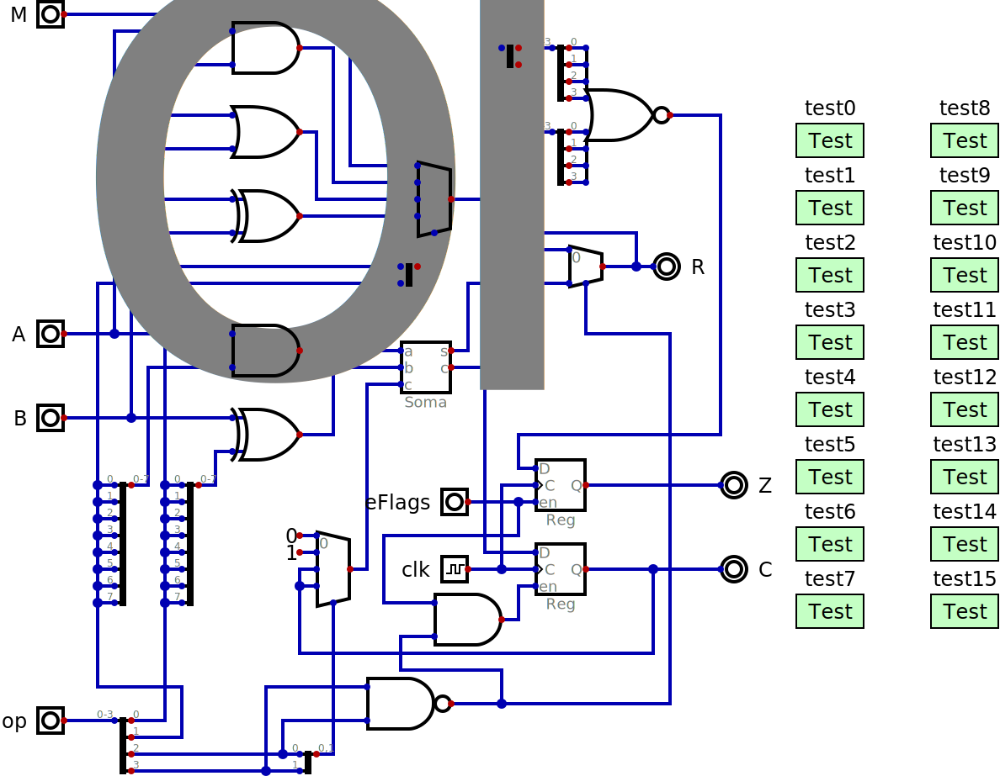
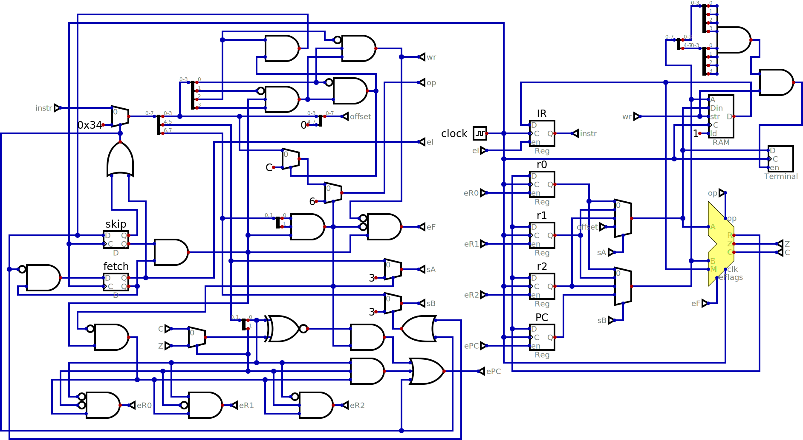

# NCPU

This simple 8 bit processor was inspired by the MCPU (hence the similar name),
the Data General Nova (so the "N" in the name). It has three general purpose
registers (*r0*, *r1* and *r2*), a program counter (*P*) and an instruction
register (*IR*). A two bit register in the ALU stores the carry (*C*) and
zero (*Z*) flags and a two bit register in the control unit indicates the
current cycle (*fetch*, *execute* and *skip*).

There are two instruction formats:

| 7 | 6 | 5 | 4 | 3 | 2 | 1 | 0 |
|---|---|---|---|---|---|---|---|
| s | s | d | d | c | c | a | i |
| 1 | 1 | t | t | b | b | b | b |

The second format is for conditional branches. The *t* field selects between
different tests on the two flags (carry=0, carry=1, zero=0 or zero=1) and the
"b" field is how much to add to the program counter (*P*) if the test passes.
The names of the instructions are *bcc*, *bcs*, *bzc* and *bzs*. Macros can
give alternative names for the last two instructions, like *bne* and *beq*.

*d* indicates where the result of an option is stored (registers *r0*, *r1*,
*r2* or the program counter *P*).

*s* indicates where the second source (the first is the same as the destination)
of the operation comes from. *P* is not a valid source since it would indicate
a conditional branch instead.

*c* indicates where the carry in comes from (always 0, always 1, the C register
or this is a logical operation instead of an addition). *a* means the destination 
is added and *i* means the source is bitwise inverted. The possible operations are:

| carry | a=0, i=0 | a=0, i=1 | a=1, i=0 | a=1, i-1 |
|-------|----------|----------|----------|----------|
| 0     | B        | not B    | A+B      | A-B-1    |
| 1     | B+1      | 0-B      | A+B+1    | A-B      |
| C     | B+C      | (1-C)-B  | A+B+C    | A-B+(1-C)|
| logic | M        | A and B  | A or  B  | A xor B  | 

Four of these operations are not very useful, but it would complicate the circuit
not to have them. *M* is data coming from the memory and addressed by *P*, making
this a *ldi* (load immediate) instruction. While all other instructions take two
clock cycles, *ldi* has an extra "skip" cycle since it is not possible to both
store the incremented *P* and the data from memory to the destination at the same time.

The "B+C" and "(1-C)-B" operations are replaced by the *lda* (load) and *sta* (store)
instructions, respectively:

| cc / ai | 00  | 01  | 10  | 11  |
|---------|-----|-----|-----|-----|
| 00      | mov | not | add | ?   |
| 01      | inc | neg | ?   | sub |
| 10      | lda | sta | adc | sbb |
| 11      | ldi | and | or  | xor |

It might seem odd to only have condiction branches and with such a limited range
but *ldi p,210* can be used to jump to location 210. Macros can be used to define
*jmp* to be the same this instruction to make programs look more traditional and easier
to understand.

Another macro is for the *lea* (load effective address) instruction which is just
*ldi* but with the argument converted into an offset from the start of the
program. Otherwise GNU AS doesn't handle labels correctly.

In RISC processors *nop* is also normally a macro and not an instruction that
the processor actually implements. For the FCPU we could use *mov r0,r0* which
is 0x00. This means that a region of memory which has been clear will be
interpreted as a sequence of *nop* instructions.

Note that though no instruction name has been defined for the "A+B+1" operation
it is actually used internally for the branch instructions so that offset 0 does
something useful instead of just jumping to the next instruction no matter what
the flags are.

The circuit *alu.dig* implements all functions of the above table as well
as tests for each different function.

In *ncpu_terminal.svg* we have the datapath for the processor on the left,
a 256 byte RAM and an interface to a text terminal in the top middle
(writing to address 0xFF saves to memory as well as sending the character
to the terminal) and some switches on the right where the control unit
will be. Controlling the switches it is possible to manually execute
instructions.

## FCPU16

256 bytes of memory is not much to do anything interesting though my first
computer in 1980, the [MEK6800D2](https://en.wikipedia.org/wiki/MEK6800D2)
only had that much RAM. Its 6800 processor could address 64KB and the
machine did have a debugger in a 1KB ROM but in any case such small memory
is limiting. A solution would be to expand the FCPU to 16 bits. If we use
word addresses to avoid the complications of bytes then this would raise the
limit to 128KB.

Only the instruction fetch would have to be slightly modified. The rest of
the system would just have all components defined as 8 bits wide changed to
16 bits so the schematic would remain the same. The instructions would
remain the same but immediate values would be 16 rather than 8 bits. With
24 bit immemdiate instructions unaligned 16 bit values would have to be
handled half of the time. It is possible greatly simplify the fetch hardware
at the cost of complicating the assembler a bit if we define that the
immediate values are always in the words following the instruction:

    0C       ldi r0,0x1234
      12     add r1,r0
    1234
    D7       bcs extrabit

So the immediate value for the *ldi* instruction comes after the *add*
instruction which is packed in the same word. When the *ldi* instruction
is being executed the *add* has already been read into *IR* and *P* is
already pointing to the immediate value. After it executes *P* will be
pointing to the *bcs* instruction but it would be loaded yet and *add*
will execute instead. Having both instructions in the same word be
immediate causes no additional complications.
