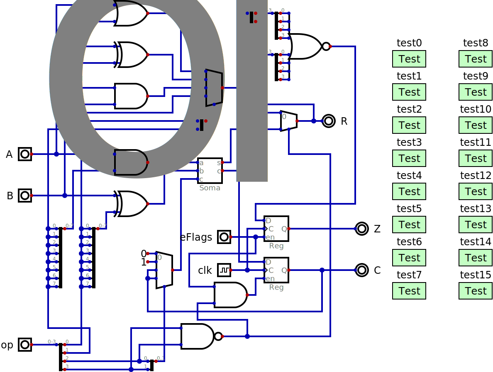

# NCPU

This simple 8 bit processor was inspired by the MCPU (hence the similar name),
the Data General Nova (so the "N" in the name) and has a lot in common with
the Femto8 from Steven Hugg's book "Designing Video Game Hardware in Verilog"
and used in the [8 Bit Workshop](https://8bitworkshop.com/) tool.

There are two instruction formats:

| 7 | 6 | 5 | 4 | 3 | 2 | 1 | 0 |
|---|---|---|---|---|---|---|---|
| s | s | d | d | c | c | a | i |
| 1 | 1 | t | t | b | b | b | b |

The second format is for conditional branches. The *t* field selects between
different tests on the two flags (carry=0, carry=1, zero=0 or zero=1) and the
"b" field is how much to add to the program counter (*P*) if the test passes.

*d* indicates where the result of an option is stored (accumulator *A*,
accumulator *B*, memory addressed by B indicated as *M* or the program
counter *P*).

*s* indicates where the second source (the first is always the accumulator *A*)
of the operation comes from (an immediate value following the instrucion *I*,
the accumlator *B* or memory addressed by B *M*). The *s* field can only be 0,
1 or 2.

*c* indicates where the carry in comes from (always 0, always 1, the C register
or this is a logical operation instead of an addition). *a* means accumulator
is added and *i* means input b is bitwise inverted. The possible operations are:

| carry | a=0, i=0 | a=0, i=1 | a=1, i=0 | a=1, i-1 |
|-------|----------|----------|----------|----------|
| 0     | B        | not B    | A+B      | A-B-1    |
| 1     | B+1      | 0-B      | A+B+1    | A-B      |
| C     | B+C      | (1-C)-B  | A+B+C    | A-B+(1-C)|
| logic | A or B   | A xor B  | A and B  | A        | 

The *B* in this table really means *I*, *B* or *M* depending on *s*. Four of these
operations are unlikely to be useful but are a side effect of how the ALU is
designed.

The first letter in an assembly instruction selects the destination and can be
"a", "b", "m" or "p". The next letters select the function and can be
"b", "not", "add", ?, "inc", "neg", ?, "sub",
?, ?, "addc", "subc", "or", "xor", "and", "a". The final letter indicates the
source and can be "i", nothing or "m". In the first case there is also an
expression that generates the second byte in the instruction. That means that
there are 4 times 12 times 3 possible mnemonics, 144 in all.

There are 4 more mnemonics for the branches, but given the use of "b" above to
indicate a destination these will instead be "jcc", "jcs", "jzc" and "jzs". It
might seem odd to only have condiction branches and with such a limited range
but "pbi 210" can be used to jump to location 210. Macros can be used to define
*jmp* to be the same as *pbi* to make programs look more traditional and easier
to understand.

In RISC processors *nop* is also normally a macro and not an instruction that
the processor actually implements. For the FCPU we could use *bb* (0x50) or
*aa* (0x4F) as a *nop*. Some processors go out of their way to have their *nop*
instructions be either all zeros or all ones so that memory that has been
cleared or EPROMs regions that haven't been "burned" will be interpreted as a
sequence of *nop* instructions. In the case of the FCPU a region of memory with
all zeros will have every two bytes interpred as *abi 0* which clears the
assumulator *A*.

The circuit *alu_test.dig* implements all functions of the above table as well
as tests for each different function.

## FCPU16

256 bytes of memory is not much to do anything interesting though my first
computer in 1980, the [MEK6800D2](https://en.wikipedia.org/wiki/MEK6800D2)
only had that much RAM. Its 6800 processor could address 64KB and the
machine did have a debugger in a 1KB ROM but in any case such small memory
is limiting. A solution would be to expand the FCPU to 16 bits. If we use
word addresses to avoid the complications of bytes then this would raise the
limit to 128KB.

Only the instruction fetch would have to be slightly modified. The rest of
the system would just have all components defined as 8 bits wide changed to
16 bits so the schematic would remain the same. The instructions would
remain the same but immediate values would be 16 rather than 8 bits. With
24 bit immemdiate instructions unaligned 16 bit values would have to be
handled half of the time. It is possible greatly simplify the fetch hardware
at the cost of complicating the assembler a bit if we define that the
immediate values are always in the words following the instruction:

    4F       abi 0x1234
      82     aaddm
    1234
    D7       jcs extrabit

So the immediate value for the *abi* instruction comes after the *aaddm*
instruction which is packed in the same word. When the *abi* instruction
is being executed the *aaddm* has already been read into *IR* and *P* is
already pointing to the immediate value. After it executes *P* will be
pointing to the *jcs* instruction but it would be loaded yet and *aaddm*
will execute instead. Having both instructions in the same word be
immediate causes no additional complications.
