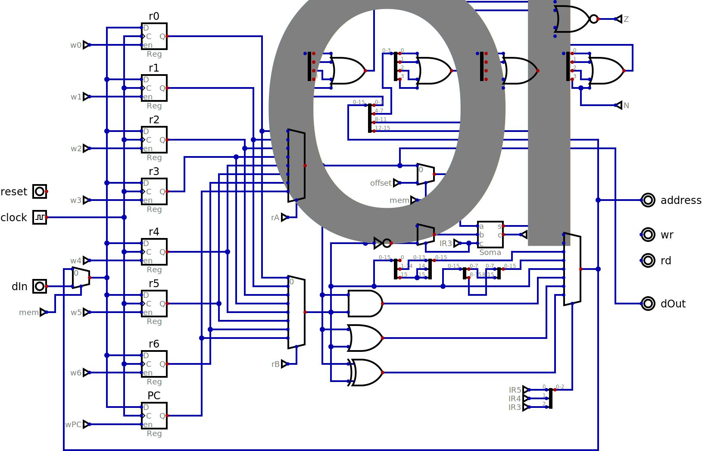

# NCPU16

One interesting feature of the Data General Nova was that the instructions were defined such that individual bits directly controlled part of the datapath. This was not the case for the 8 bit *NCPU* where the complexity of the control unit far exceeded that of the datapath.

With 16 bit instructions it is possible to simplify the design of the control unit.

## Instruction set

The compute instructions have this format:

| 15 14 | 13 12 11 | 10 09 08 | 07 | 06 | 05 04 | 03 02 | 01 00 |
|-------|----------|----------|----|----|-------|-------|-------|
| 0 0   | rA       | rB       | 0  | nsv| ALU   | shift | skip  |

The *rA* and *rB* fields select one of eight registers to be the destination / source A of an operation and the source B of the operaion. The *nsv* bit stops the result of the operation being saved back into the *rA* register. Register 7 is used as the program counter.

The four operations selected by *ALU* are: A+B, A-B, A&B and A|B. The mneomonics are: *ADD*, *SUB*, *AND* and *OR*.

The four possiblities for the rotation circuit selected by *shift* are rotate right by: 0, 1, 4 and 8 (swap bytes).

The four conditions to skip the following instruction selected by *skip* are: don't skip, skip if carry clear, skip if zero, skip if not zero

The memory instructions have this format:

| 15 14 | 13 12 11 | 10 09 08 | 07 | 06 05 04 03 02 01 00 |
|-------|----------|----------|----|----------------------|
| 0 0   | rA       | rB       | 1  | offset               |
| mem   | rA       | rB       | R  | offset               |

The two bits of *mem* are 0 0 for the *LEA* instruction. The effective address is the value in the *rB* register added to the signed extension of the 7 bit offset (so -64 to +63). The calculated effective address is simply saved to *rA* in the case of *LEA*.

Other values of *mem* changes the timing of memory instructions:

| IR15 IR14 | IR07 | assembly            |  cycle 1                | cycle 2            |
|-----------|------|---------------------|-------------------------|--------------------|
| 0 1       | 0    | STA rA,rB,offset    | mem[@rB+offset] := @rA  |                    |
| 0 1       | 1    | LDA rA,rB,offset    | @rA := mem[@rB+offset]  |                    |
| 1 0       | 0    | _STA rA,rB,offset   | @rB := @rB + offset     | mem[@rB] := @rA    |
| 1 0       | 1    | _LDA rA,rB,offset   | @rB := @rB + offset     | @rA := mem[@rB]    |
| 1 1       | 0    | STA_ rA,rB,offset   | mem[@rB] := @rA         | @rB := @rB + offset|
| 1 1       | 1    | LDA_ rA,rB,offset   | @rA := mem[@rB]         | @rB := @rB + offset|

To do a subroutine call with a traditional RISC style (saving the address to some register, like *r5*) requires several instructions:

           LEA r5,r7,retAddr-.
           LDA r7,r7,1
           .word subAddr
       retAddr:

And to go back to the previous routine:

            LEA r7,r5,0

The problem with this scheme is that it only allows one level of subroutine call. A solution is to save the return address to a stack, for example with *r6* pointing to the next empty word and growing downwards the subroutine could start as:

         subAddr:
             STA_ r5,r6,-1

and the code to return could feth the value directly from the stack:

            _LDA r7,r6,1

## Implementation

