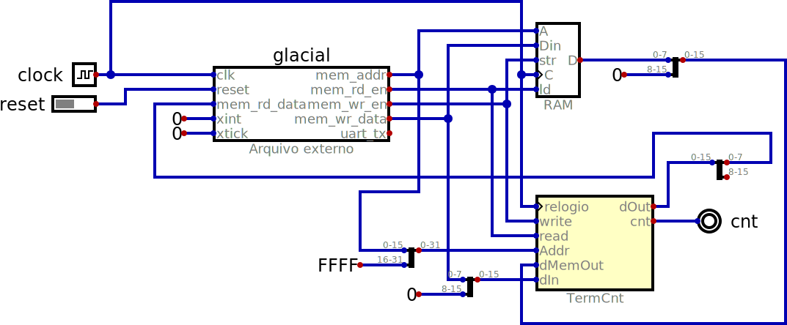
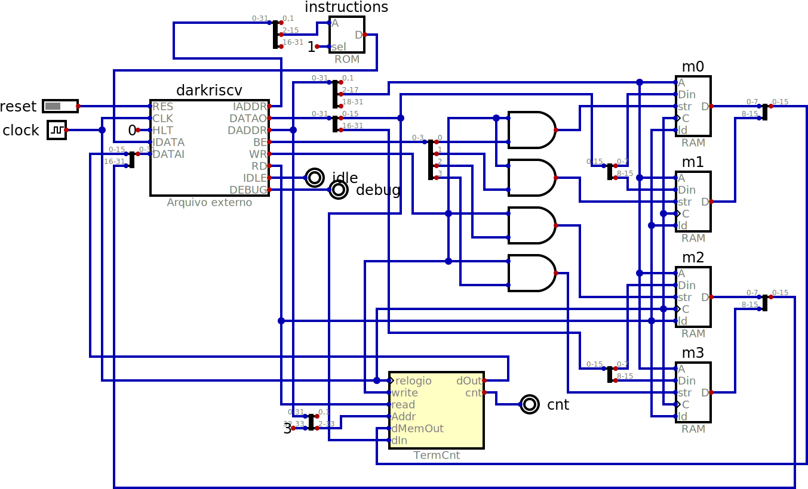

# RISC-V Wrappers

It is possible to define a compoenent in a Digital simulation that either contains
VHDL or Verilog code inside it or references an external file with such code.

In theory it is possible to just reference the top level HDL source and have that
include any additional files it needs, but in practice for the projects listed
below we will merge all files into a single one with a text editor.

The RARS simulator written in Java is used to verify that the benchmark code is
correct, but the assembler it uses has a few differences relative to GNU AS. The
simulator's system call 11 is used to output characters to the console in place
of the terminal used in the wrappers. While the terminal uses either CR or LF, RARS'
console needs a LF. The modified sources for RARS have "sim" in their name.

## [SERV by Olof Kindgren](https://github.com/olofk/serv)

a serial implementation trades off performance for small size by doing operations one bit at a time

## [Glacial by Eric Smith](https://github.com/brouhaha/glacial)

this 8 bit implementation uses microcode to execute 32 bit RISC-V instruction

The first 2.5KB of memory are occupied by the "microcode" which simulates the RV32I
instruction set. The actual RISC-V code must be displaced to 0x0A00.

## [Darkriscv by Marcelo Samsoniuk](https://github.com/darklife/darkriscv)

designed in a single night it is a very typical small RISC-V

It didn't seem to correctly address the counter and terminal but with a change in
the *sh* and *ld* instructions this seems to have been fixed. The very first
store to counter doesn't seem to output the write signal. SIN and COS are
probably not being correctly calculated.

## [PicoRV32 by Claire Xenia Wolf](https://github.com/YosysHQ/picorv32)

created to fit into small FPGAs this is a popular option for embedded systems

## [Vexriscv by Papon Charles](https://github.com/SpinalHDL/VexRiscv)

the SpinalHDL implementation offers many options, one of which is the exported Verilog used here
