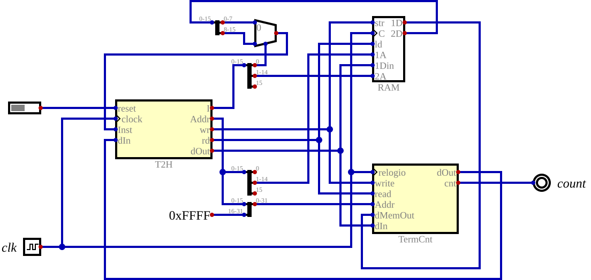
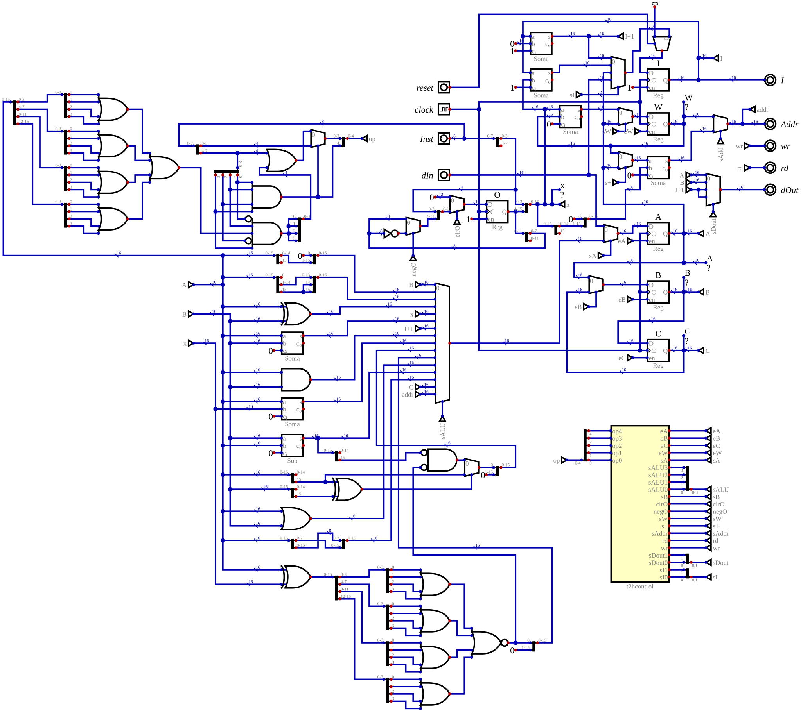
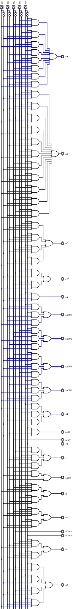
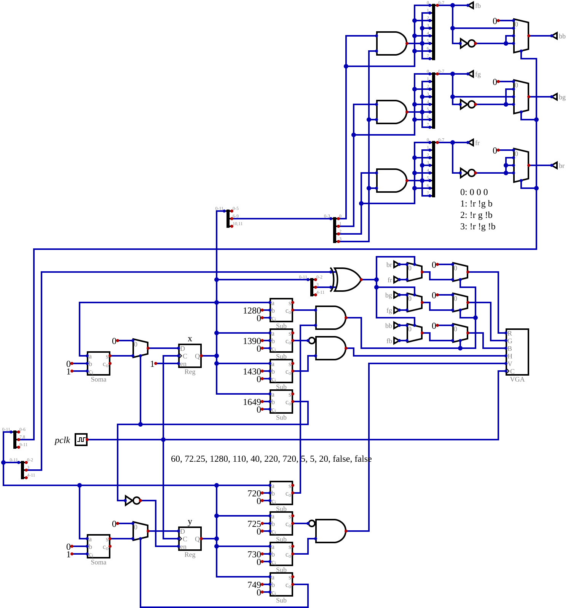
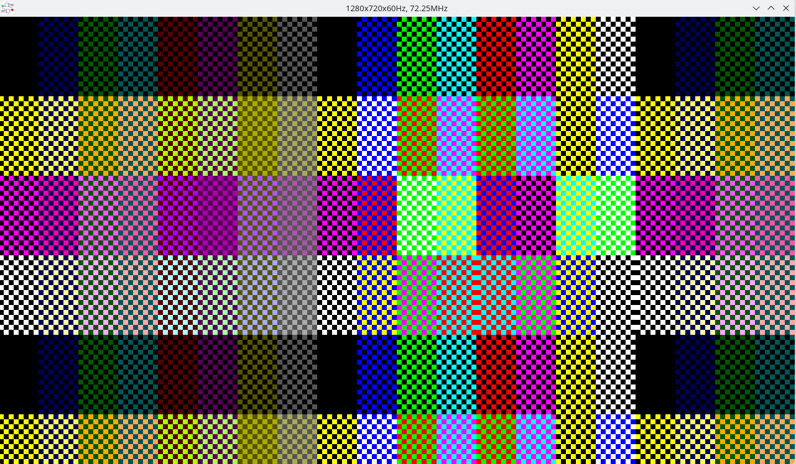

# T2H

This 16 bit processor has instructions based on the Inmos T2xx Transputer.

It uses a three element stack with registers *A*, *B* and *C*. *W* is the
workspace pointer and local variables are stored in memory relative to it.
*I* has a pointer to the current instruction. An addional 12 bit register,
*O*, is used to extend the argument in direct instructions.

None of the fancy Transputer features such as the communication links or
the operating system in hardware are included in T2H, The *H* in the name
indicates that unlike the Transputer which uses a von Neumann architecture,
the T2H uses a Harvard architecture with a byte wide instruction memory that
is separate from the 16 bit data memory. The Transputer uses byte addressing
and so a T2xx can have 64KB.

## Direct Instructions

The first instruction format is for the direct instructions where the top
4 bits of the instruction select the operation while the bottom 4 bits are
the data to be operated on. This is known as "one address" instructions.

Three of the 16 instructions are not independent but are used to modify the
following instructions. One is "operate" and uses the data as the opcode for
an indirect instruction (shown further down). The prefix and negative prefix
codes will combine its four bit data with the data of the following instruction
allowing a compact encoding of any sized data.

| op code | assembler | A | B | C | I   | W | O | Addr | dOut |
|---------|-----------|---|---|---|------|---|---|------|------|
| 0x      | j x       |   |   |   |I+1+x|   | 0 |      |      |
| 1x      | ldlp x    |W+x*2| A | B |I+1  |   | 0 |      |      |
| 2x      |           |   |   |   |I+1  |   |(O<<4)\|x |  |    |
| 3x      | ldnl x    |dIn|   |   |I+1  |   | 0 | A+x*2  |      |
| 4x      | ldc x     | x | A | B |I+1  |   | 0 |      |      |
| 5x      | ldnlp x   |A+x*2|   |   |I+1  |   | 0 |      |      |
| 6x      |           |   |   |   |I+1  |   | (~O<<4)\|x |  | |
| 7x      | ldl x     |dIn| A | B |I+1  |   | 0 | W+x*2  |      |
| 8x      | adc x     |A+x|   |   |I+1  |   | 0 |      |      |
| 9x      | call x    |   |   |   |I+1+x|   | 0 | W    | I+1 |
| Ax      | cj x (A==0)|  |   |   |I+1+x|   | 0 |      |      |
| Ax      | cj x (A!=0)| B| C | ? |I+1  |   | 0 |      |      |
| Bx      | ajw x     |   |   |   |I+1  |W+x| 0 |      |      |
| Cx      | eqc x     |A==x|  |   |I+1  |   | 0 |      |      |
| Dx      | stl x     | B | C | ? |I+1  |   | 0 | W+x*2  | A    |
| Ex      | stnl x    | C | ? | ? |I+1  |   | 0 | A+x*2  | B    |

The assembly names and opcode of the direct instructions are the same as the
Transputer, but two instructions have a slightly different operation. *call*
does not change *W* and only saves *I* while the Transputer saves all registers
after changing "W" to have 4 new words.

## Indirect Instructions

These are the "zero address" instructions which operate exclusively on the
internal stack. While the Transputer allows an arbitrary number of indirect
instructions using the prefixes and while these instructions are microcoded
and can be arbitrarily complex, T2H only uses the first 16 opcodes and limits
itself to one clock instructions.

| op code | assembler | A | B | C | I | W | O | Addr | dOut |
|---------|-----------|---|---|---|----|---|---|------|------|
| F0      | rev       | B | A |   |I+1|   | 0 |      |      |
| F1      | shl       |A<<1|  |   |I+1|   | 0 |      |      |
| F2      | shr       |A>>1|  |   |I+1|   | 0 |      |      |
| F3      | xor       |A\^B| C | ? |I+1|   | 0 |      |      |
| F4      |           |   |   |   |    |   |   |      |      |
| F5      | add       |A+B| C | ? |I+1|   | 0 |      |      |
| F6      | gcall     |I+1|  |   | A  |   | 0 |      |      |
| F7      | and       |A&B| C | ? |I+1|   | 0 |      |      |
| F8      |           |   |   |   |    |   |   |      |      |
| F9      | gt        |B>A| C | ? |I+1|   | 0 |      |      |
| FA      | dup       | A | A | B |I+1|   | 0 |      |      |
| FB      | or        |A\|B| C| ? |I+1|   | 0 |      |      |
| FC      | sub       |B-A| C | ? |I+1|   | 0 |      |      |
| FD      | swb       |AL,AH| |   |I+1|   | 0 |      |      |
| FE      | gajw      | W |   |   |I+1| A | 0 |      |      |
| FF      | ret       |   |   |   |dIn |   | 0 | W    |      |

The *shl* and *shr* instructions shift by a single bit instead of
by the number of bits indicated in *B* like the Transputer, so a loop
is required in the general case.

The *swb* (swap bytes) is not a Transputer instruction and used to compensate
for the lack of the word length independent features. It helps deal with byte
data stored in the 16 bit word addressed data memory.

## Assembler

By including the *t2h.inc* macro definitions, the GNU AS program can assemble
T2H programs. One simplification is that all control flow instructions are
generated with 3 prefix bytes by default. An extra argument can change that to 0, 1
or 2 for forward jumps and -1 or -2 for backward jumps. Changing the default
makes programs shorter, but might cause problems if edits move labels further
from the jumps.

The *../as2hex* script can be used to invoke *as* and then *objcopy* to convert
the generated binary into Intel HEX format.

## Implementation

The top level circuit includes a T2H processor, a block that implements a keyboard
and output terminal as well as a count that is useful for benchmarks and a dual
port memory. FPGAs normally allow each port of a dual port memory to have a different
width, but the *Digital* simulator does not have that option so a multiplexer is
needed to implement the 8 bit interface for the T2H instruction input.

The datapath of the processor has most of its complexity in the ALU to generate new
values for the *A* register. The logic on the top left maps the 8 bits instructions
into a 5 bit opcode. If the top 4 bits are 0xF then the 4 bottom bits are used as the
opcode but with the fifth bit set. Otherwise the top 4 bits are used with the fifth
bit cleared. But when the top bits are 0xC and the *A* register is not zero then the
opcode is replaced with 0x0F.

A simple combinational circuit converts the 5 bit opcode into all the control signals
for the datapath. This was generated automatically by *Digital* from a truth table
that was manually typed in. Combining it with the rest of the processor proved to be
awkward graphically since it is very tall, so it was split into its own module.

## Video

A quick test of colors for a videotext style text output has been started but is still
very incomplete.

The plan is to have an 8KB memory with both the character patterns
and the 80x30 character buffer. With a 1280x720 resolution a 16x24 pixel font will be
used. 16 colors can be used for the foreground and 4 background modes can derive the
background by selectively inverting the R, G and B components. This allows the color
combinations to be defined with only 6 bits and a very simple circuit, though not all
64 combinations are unique.

| character | description |
|-----------|-------------|
| 0x00 - 0x1F | blank |
| 0x20 - 0x7F | patterns in memory |
| 0x80 - 0xBF | shows as blank, bottom 6 bits change color |
| 0xC0 - 0xFF | bottm 6 bits define 2x3 pattern |
