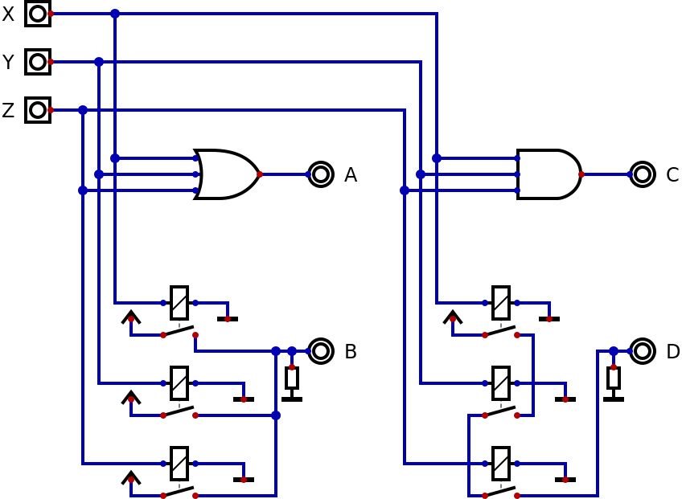
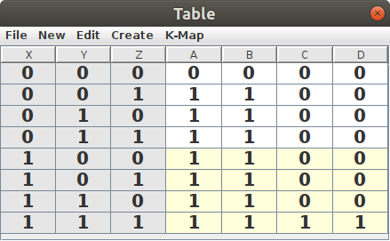
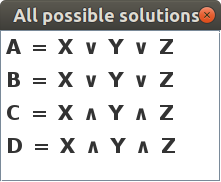

# Combinational Circuits

Combinational circuits are those that have an output that depends exclusively on the different combinations of the inputs.

## 2 Input Logic Gates

For circuits with two inputs there are only 4 possible input combinations: 0 and 0, 0 and 1, 1 and 0 as well as 1 and 1. Since different circuits can output either a 0 or a 1 in each case, this means we can only have 2^4 possible two input combinational circuits. 16 is a small enough number that we can show them all at once:

Using the "analysis" function of Digital we can verify that these 16 circuits are indeed all the possible 2 input combinational circuits by noting that columns A through P are the binary numbers 0 through 15 without skiping any nor repeating.

Note that A and P don't really have any inputs at all, while D, F, K and M only take a single input. But it would be easy to implement all these 6 functions using two input ciruits instead. A circuit that did AND(X,NOT(X)) would always output 0, for example, and so could implement A.

The textual notation used for the above circuit is only one of many you might find. In fact, if you look at the "settings" command in the "edit" menu for Digital you will see some of the alternative notations.

The first notation in the menu uses the syntax from the C programming language. The second one is similar to what we used above for the alternative circuit for A. The other notations come from different areas of mathematics which overlap to some extent.

| Area | | | | | |
| --------- | ---- | ----- | ----- | -----| ----- |
| Boolean algebra | 1 | 0 | inverse | sum | product |
| Predicate Logic | true | false | not | or | and |
| Set theory | univeral set | empty set | complement | union | intersection |
| switching circuits | 5V | 0V | normally closed | parallel | series |

First introduced in 1847 by George Boole and extended by him in 1854, what is now called Boolean Algebra works very much like normal algebra but its variables can only have the values 1 and 0. That makes addition slightly different than normal and 1 plus 1 results in 1 instead of 2. We can use "+" to indicate sums, and either nothing at all or "x" to indicate multiplication. The inverse function can be represented by a prefix "~", "!", "¬" or by an overline over the expression to be inverted.

For the special case where only the universal set and the empty set are used, Set Theory (formalized by Georg Cantor in 1874) gives us the same results as Boolean Algebra. Instead of a product we can use the intersection operation ("∩") and instead of a sum we can use the union operation ("∪"). The complement is the diference between the univeral set and some variable.

Traditionally Logic has been a part of philosophy and rhetoric, though the development of predicate logic by the Stoics (3rd century BC) set the stage for the 19th century evolution into a branch of mathematics. In analogy to the set operators, we can use "∧" for conjunction (AND) and "∨" for disjunction (OR). These symbols are also often used in Boolean Algebra as alternatives to the ones already listed above.

Though the basic building blocks are called "logic gates" because their operations can be described by, among others, predicate logic this does not mean that the computers built from such blocks can be called "logical" in the popular sense of that word. Mathematical logic can be implemented in computers through programming languages such as Prolog, but you still need huge databases of "common sense" facts (such as attempted in the Cyc project) for computers to operate in a way that most people would call logical. The current Large Language Models trained on the content of the World Wide Web are a good alternative way of achieving this functionality.

Claude Shannon's 1937 master's thesis "A Symbolic Analysis of Relay and Switching Circuits" proved that Boolean Algebra could be used to describe switching circuits made from relays.

Having Digital generate a truth table for the four circuits shows that A and B implement the same function, as do C and D.

This means that connecting relays in parallel is equivalent to the OR gate and connecting them in series gives us the same result as the AND gate. This can be seen in the equations generated from the Digital analysis option.

Thinking in terms of switches, it is obvious that the OR and AND gates can be easily extended to any number of inputs and not just 2. The NOT gate (which can be implemented with a normally closed relay) always has a single input.

When generating the equations for a circuit, Digital will always express them in terms of NOT, AND and OR operators. In the circuit with all 16 two input gates we see the XOR (exclusive OR) and XNOR (equivalence) gates as well and these are basic operations in predicate logic. So which gates are the most fundamental and which can be created as compound circuits using other gates?

