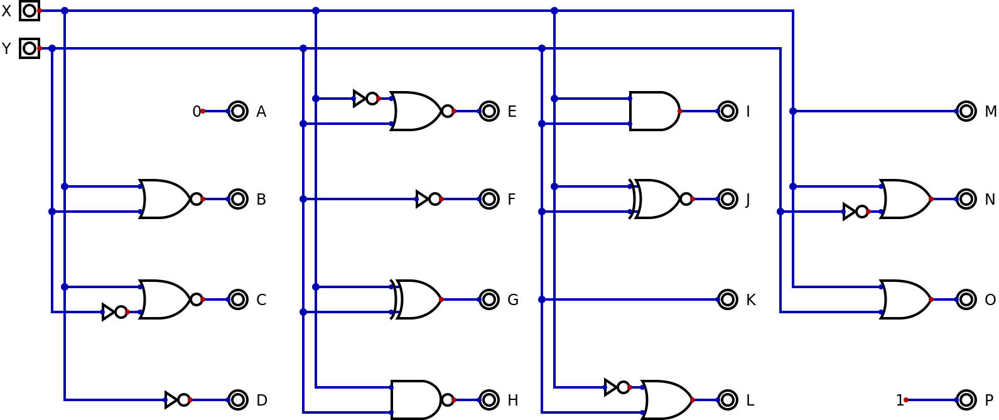
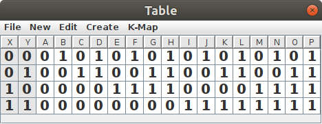
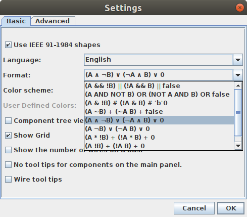

# Combinational Circuits

Combinational circuits are those that have an output that depends exclusively on the different combinations of the inputs.

For circuits with two inputs there are only 4 possible input combinations: 0 and 0, 0 and 1, 1 and 0 as well as 1 and 1. Since different circuits can output either a 0 or a 1 in each case, this means we can only have 2^4 possible two input combinational circuits. 16 is a small enough number that we can show them all at once:

Using the "analysis" function of Digital we can verify that these 16 circuits are indeed all the possible 2 input combinational circuits by noting that columns A through P are the binary numbers 0 through 15 without skiping any nor repeating.

Note that A and P don't really have any inputs at all, while D, F, K and M only take a single input. But it would be easy to implement all these 6 functions using two input ciruits instead. A circuit that did AND(X,NOT(X)) would always output 0, for example, and so could implement A.

The textual notation used for the above circuit is only one of many you might find. In fact, if you look at the "settings" command in the "edit" menu for Digital you will see some of the alternative notations.

The first notation in the menu uses the syntax from the C programming language. The second one is similar to what we used above for the alternative circuit for A. The other notations come from different areas of mathematics which overlap to some extent:

| Boolean algebra | 1 | 0 | inverse | sum | product |
| Logic | true | false | not | or | and |
| Set theory | univeral set | empty set | complement | union | intersection |
| switching circuits | 5V | 0V | normally closed | parallel | series |

