# drv16

The drv16 processor is based on the RISC-V standard but with only 16 registers
of 16 bits each. It implements fewer instructions than RV32E, but the ones it
does implement use the same mneomonic and have the same functionality.

In many cases drv16 will be used for helper functions in a project, like
abstracting the interface to a keyboard or SD card. Any logic taken up by drv16
is logic not available to the main project. Just being 16 instead of 32 bits
should make it take half as much area as a RV32E processor and even less than
that relative to a RV32I. Such applications need very little memory so the
ability to address more than 64KB would be wasted.

An additional motivation for reducing state is to make it easier for people
to handle it. A 16 bit number like 0xC7F0 is more digestible than something
like 0xC7F0AA35, which is important in an educational context.

## Performance

The priority is having a very small implementation, but performance is not too
bad for a multi-cycle processor. All instructions execute in two clock cycles
(*fetch* and *execute*) with an immediate extension word adding another cycle
before the *fetch* for a total of three clock cycle(multiple extensions can be
present resulting in more than three cycles, but only the last one is actually
used. Memory regions with all zeros will execute a sequence of extensions at
one clock per word).

The clock frequency is limited by the critical path which makes this processor
slower than a pipelined one, `clock cycle > IR delay + control unit delay +
register bank delay + alu input select delay + alu delay + address mux delay +
memory delay`.

## Instructions

The binary encoding of the instructions is 16 bits but is not compatible with the
RISC-V C extension. The most significant difference is the instruction which adds
12 bits to the 4 bit immediate value of the following instruction (it is treated
as a single 32 bit instruction).

All other instructions have the format:

| 15 14 13 12 | 11 10 09 08 | 07 06 05 04 | 03 02 01 00 |
|-------------|-------------|-------------|-------------|
| rD | rS1 | rS2 | operation |

Register x0 holds the current program counter (PC), but when the rD field is
zero no register is changed and when rS1 or rS2 are zero the value 0 is used
in place of whatever is in x0.

Using a non latched memory (an option for BRAMs in some FPGAs and
how external SRAM chips work) all instructions can run in two clock cycles
(fetch and execute). *PC* holds the address of the currently executing instruction
during the execute phase, so the address presented during fetch is the result
of adding 2 to *PC*. This has a side effect that the offset for **JAL** and the
branches is from the current instruction and not the next one like in RISC-V.
This is compensated for in the assembler to avoid complicating the hardware.
Since we have 16 bit instead of 12 bit offsets, this is not a limitation. The
offset for **JALR** does not need any changes since *PC* doesn't enter into
its calculation.

In the table below, **@rS2** indicates the 16 bit value in the register addressed
by the rS2 field of the instruction while a plain **rS2** indicates a 4 bit
immediate value extended to 16 bits from the start of a 32 bit instruction pair.
**rD** indicates a 4 bit immediate value that might be extended or not depending
on whether the previous instruction is par of a pair.

| operation | mnemonic | execute | fetch |
|-----------|----------|---------|-------|
| 0 |  |  | @IM := @IR, @IR := mem[@PC := @PC + 2] |
| 1 | JAL | @rD := @PC + 2 | @IR := mem[@PC := @PC + (@IM \| rS2)] |
| 1 | JALR | @rD := @PC + 2 | @IR := mem[@PC := @rS1 + (@IM \| rS2)] |
| 2 | BEQ | cond := @rS1 = @rS2 | @RI := mem[@PC := @PC + (cond?(@IM \| rD):2)] |
| 2 | BNE | cond := @rS1 ~= @rS2 | @RI := mem[@PC := @PC + (cond?(@IM \| rD):2)] |
| 3 | BLT | cond := @rS1 < @rS2 | @RI := mem[@PC := @PC + (cond?(@IM \| rD):2)]] |
| 3 | BGE | cond := @rS1 \>= @rS2 | @RI := mem[@PC := @PC + (cond?(@IM \| rD):2)] |
| 4 | LB | @rD := SignExtend(mem[@rS1 + (@IM \| rS2)]) | @IR := mem[@PC := @PC + 2] |
| 5 | LH | @rD := mem[@rS1 + (@IM \| rS2)] | @IR := mem[@PC := @PC + 2] |
| 6 | SB | mem[@rS1 + (@IM \| rD)] := 8Bits(@rS2) | @IR := mem[@PC := @PC + 2] |
| 7 | SH | mem[@rS1 + (@IM \| rD)] := @rS2 | @IR := mem[@PC := @PC + 2] |
| 8 | LBU | @rD := ZeroExtend(mem[@rS1 + (@IM \| rS2)]) | @IR := mem[@PC := @PC + 2] |
| 9 | ADD | @rD := @rS1 + @rS2 | @IR := mem[@PC := @PC + 2] |
| 9 | ADDI | @rD := @rS1 + (@IM \| rS2) | @IR := mem[@PC := @PC + 2] |
| A | SUB | @rD := @rS1 - @rS2 | @IR := mem[@PC := @PC + 2] |
| A | SUBI | @rD := @rS1 - (@IM \| rS2) | @IR := mem[@PC := @PC + 2] |
| B | SLT | @rD := @rS1 < @rS2 | @IR := mem[@PC := @PC + 2] |
| B | SLTI | @rD := @rS1 < (@IM \| rS2) | @IR := mem[@PC := @PC + 2] |
| C | SRS | @rD := (@rS1>>1) \| (@rS2 & 0x8000) | @IR := mem[@PC := @PC + 2] |
| C | SRSI | @rD := (@rS1>>1) \| (@IM & 0x8000) | @IR := mem[@PC := @PC + 2] |
| D | AND | @rD := @rS1 & @rS2 | @IR := mem[@PC := @PC + 2] |
| D | ANDI | @rD := @rS1 & (@IM \| rS2) | @IR := mem[@PC := @PC + 2] |
| E | OR | @rD := @rS1 \| @rS2 | @IR := mem[@PC := @PC + 2] |
| E | ORI | @rD := @rS1 \| (@IM \| rS2) | @IR := mem[@PC := @PC + 2] |
| F | XOR | @rD := @rS1 ^ @rS2 | @IR := mem[@PC := @PC + 2] |
| F | XORI | @rD := @rS1 ^ (@IM \| rS2) | @IR := mem[@PC := @PC + 2] |

Most instructions have two variations and the presence or not of the extension
selects between them. In the case of **BEQ** and **BNE** it is the least
significant bit of **rD** (extended or not) that selects between them as the
bit would otherwise be wasted since we can't branch or odd addresses. The same
trick is used to select between **JAL** and **JALR**.

drv16 has a **SUBI** instruction that RV32E lacks (since it can have negative
constants for **ADDI**). Missing are unsigned comparisons (**SLTIU**, **SLTU**,
**BLTU**, **BGEU**). Also missing are  **LUI** and **AUI** since constants larger than
12 bits are generated differently.

The hardware to implement shifts can be very large compared to the rest of the
processor, so the shift operations (**SLLI**, **SRLI**, **SRAI**,
**SLL**, **SRL**, **SRA**) were also omitted. But the `SLLI x3,x4,3` can be
implemented using the sequence `ADD x3,x4,x4. ADD x3,x3,x3. ADD x3,x3,x3`.
Right shifts are implemented using the **SRS** (shift right step) instruction
that is not a RV32E one. So `SRAI x3,x4,3` can be implemented as the sequence
`SRS x3,x4,x4. SRS x3,x3,x3. SRS x3,x3,x3` while `SRLI x3,x4,3` can become
`SRS x3,x4,zero. SRS x3,x3,zero. SRS x3,x3,zero`. The **SRSI** instruction is
present to simplify the hardware, but is not as useful.

**ECALL** and **EBREAK** are the two remaining RV32E instructions missing from drv16.

## Implementation

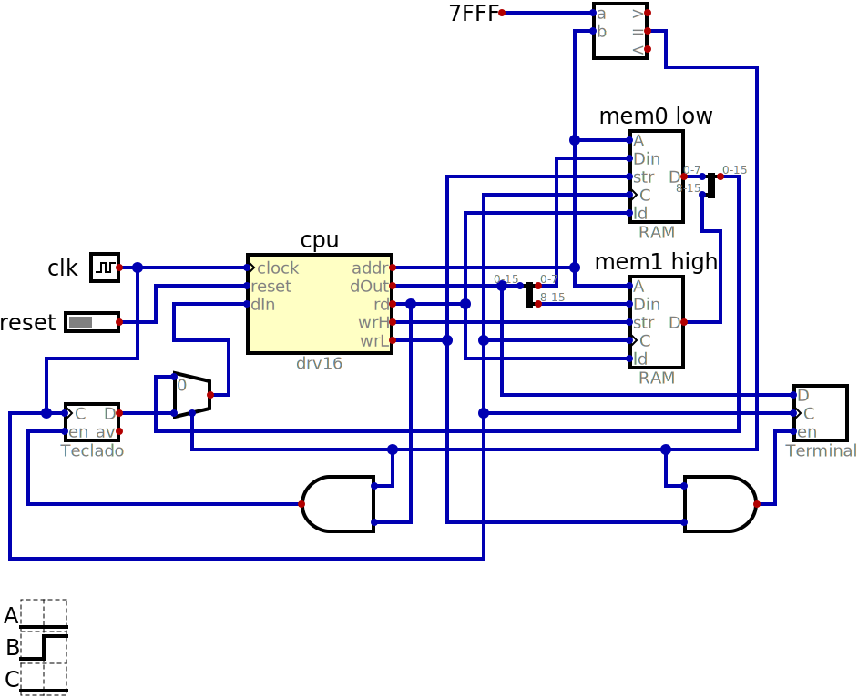

The project *system.dig* includes the drv16 processor connected to an asynchronous RAM
with 32K words of 16 bits each. Address 0xFFFE (word address 0x7FFF) is also mapped
to the terminal.

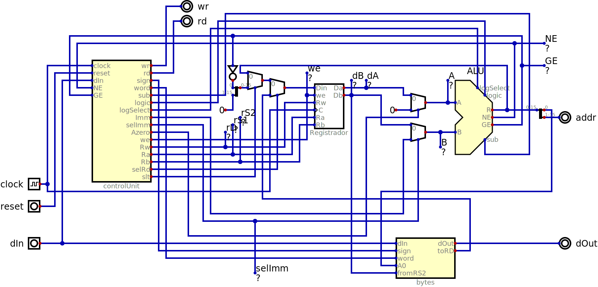

Two complications that RISC-V shares with drv16 relative to some simpler processors are
the byte access to memory and the special treatment of register zero. This is further
complicated in drv16 by storing the program counter in the register bank's address zero
since that would have been otherwise unused. This also allows the adder in the ALU to
also increment the program counter.

### FPGAs and ASICs

Exporting the subcomponent of drv16 as Verilog (in addition to a circuit with only the
register file) and using the Yosys tool to implement them for various FPGAs and
integrated technologies we have (FPGA numbers are registers / LUTs / math / distributed
memory blocks):

| technology | registers | ALU |  ALU inputs | bytes | control | drv16 |
|------------|-----------|-----|-------------|-------|---------|-------|
| NANDs      | 5029      | 660 | 109         | 117   | 471     | 6547  |
| ICE40      | 256/373/0/0 | 0/99/16/0 | 0/38/0/0 | 0/40/0/0 | 31/29/0/0 | 287/630/16/0 |
| Efinix     | 256/398/0/0 | 0/83/18/0 | 0/38/0/0 | 0/40/0/0 | 31/28/0/0 | 287/589/18/0 |
| Gowin      | 0/0/0/8     | 0/145/17/0 | 0/53/0/0 | 0/62/0/0 | 31/80/0/0 | 31/582/17/8 |
| Cyclone V  | 0/0/0/32    | 0/55/18/0 | 0/34/0/0 | 0/32/0/0 | 31/25/0/0 | 31/180/18/32 |
| Xilinx 7   | 0/0/0/8     | 0/50/5/0  | 0/35/0/0 | 0/32/0/0 | 31/23/0/0 | 31/199/5/8 |

### Datapath

The main blocks of the datapath are the register bank, the ALU input adaptor, the ALU
itself and the byte memory access adaptor. Two multiplexers allow the data written
back to the destination register be the ALU result, dIn from memory or a boolean
value indicating a signed Less Than result for a comparison.

#### ALU

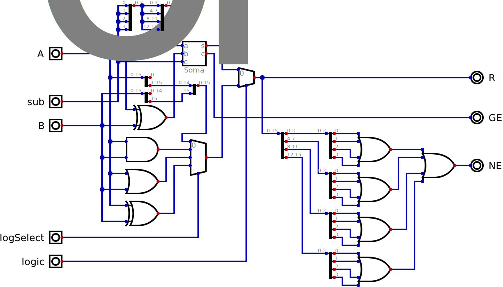

Looking at all instructions, we need to be able to add and substract a pair of 16 bit
number, do a bitwise *AND*, *OR* and *XOR* operations between them and also handle the
odd shift to the right combining with a bit from the other operand. When subtracting
we need to indicate the signed compatisons `A >= B` and `A != B`.

#### byte memory access adaptor

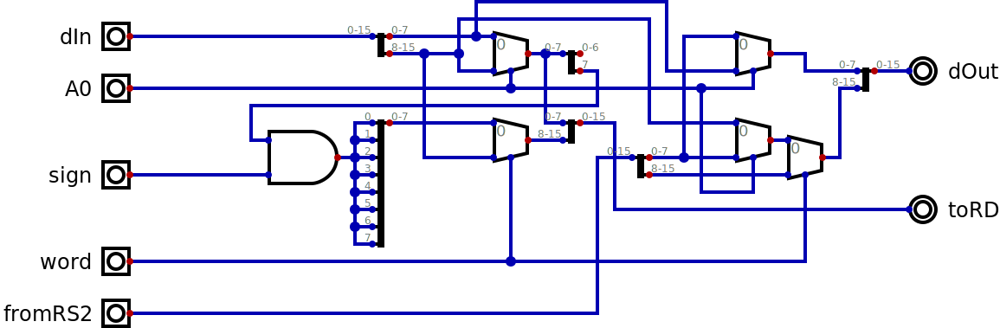

Normally writing bytes to wider memory is implemented by having a per byte chip enable
signal. For simulations in Digital it is easier to have a single, wide memory as the tool
can then easily load an Intel Hex file before simulation starts. With memories that have
separate Data In and Data Out pins, an option is to just write back the bytes that are
not supposed to be changed.

| word | A0 | rD[15:8] | rD[7:0] | dOut[15:8] | dOut[7:0] |
|------|----|----------|---------|------------|-----------|
| 0    | 0  | 8x(sign&rD[7] | dIn[7:0] | dIn[15:8] | rS2[7:0] |
| 0    | 1  | 8x(sign&rD[7] | dIn[15:8] | rS2[7:0] | dIn[7:0] |
| 1    | x  | dIn[15:8] | dIn[7:0] | rS2[15:8] | rS2[7:0] |

The table indicates how the various 8 bit multiplexers are controlled by the signals *word* (IR[0]),
*A0* and *sign* (/IR[3]). Only the multiplexer for dOut[15:8] needs more than two inputs and is best
implemented as a sequence of two selectors of two inputs each.

### Control Unit

The control unit uses the following inputs to do its job: *clock*, *reset*, *dIn*,
*NE* and *GE*. It generates: *wr*, *rd*, *sign*, *word*, *sub*, *logic*, *logSelect*,
*Imm*, *selImm*, *Azero*, *we*, *Rw*, *Ra*, *Rb*, *selRd* and *slt*

There are also some internal signals such as *alt*, *even*,*const2*, *selConst* and *immLow*.

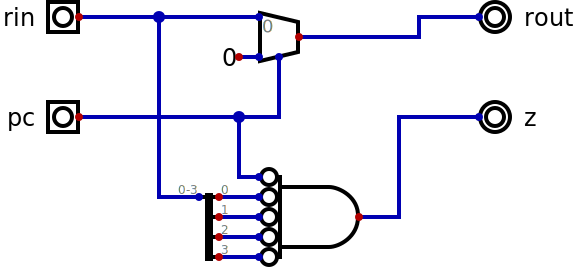

This simple circuit helps handle register zero. It allows any of the three instruction
fields to be overridden by the PC and indicates if special handling (replace with 0 for
the sources and don't write for the destination) is needed.

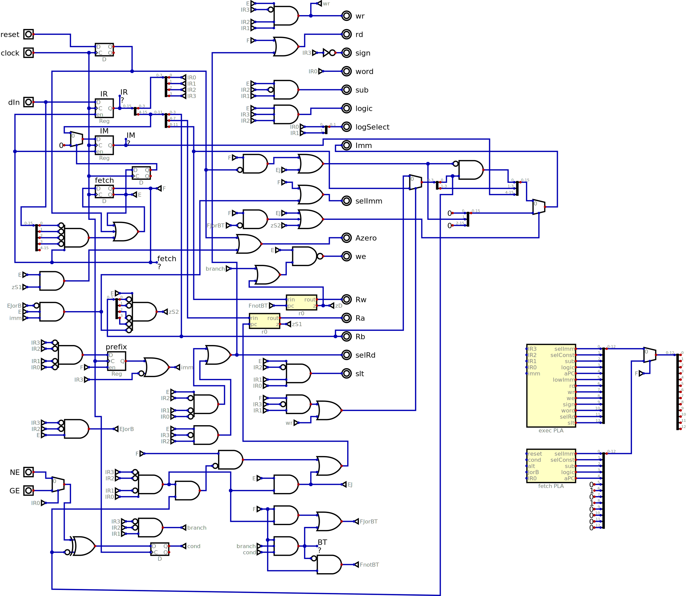

#### fetch

*IR* saves the instruction read from memory during the fetch cycle and *IM* saves the previous value of
the top 12 bits for *IM* or is cleared to 0 if the previous cycle was an execute. This allows instructions
that don't depend on the prefix to indicate an immediate to not require a prefix when that would just be
0x0000 (but the current assembler doesn't take advantage of that).

The single bit *fetch* flip-flop is the heart beat of the processor. Its normal output indicates
a fetch cycle while its inverted output indicates an execute cycle. A fetch can follow an execute
or another fetch where the data coming from memory will be a prefix instruction. If *reset* is
active then the processor will be stuck fetching from memory location 0x0000. During *reset* the
signals to execute `@IR := mem[@PC := 0]` are active. With both inputs forced to zero during reset, the values of
*logic* and *logSelect* don't make a difference.

When the instruction was **JAL**, **JALR** or a branch with `cond == true` then some signals are
changed in the next fetch cycle.

|      | even | const2 | selImm | selConst | Azero | sub | logic | aPC |
|------|------|--------|--------|----------|-------|-----|-------|-----|
| reset | X   | 0      | 1      | 1        | 1     | 0   | X     | X   |
| fetch | 1   | 1      | 1      | 1        | 0     | 0   | 0     | 1   |
| fetch JAL | 1 | X    | 1      | 0        | 0     | 0   | 0     | 1   |
| fetch JALR | 1 | X   | 1      | 0        | 0     | 0   | 0     | 0   |
| fetch cond | 1 | X   | 1      | 0        | 0     | 0   | 0     | 1   |
| execute | EJ | EJ      | ?      | EJ        | 0     | ?   | ?     | EJ   |

*aPC* is short for "force A to PC".

Signals *even* and *const2* can be implemented by the same circuit when we take the "don't cares" into
account.

#### execute

The "opcodes" selected for the different instructions is not arbitrary, but were designed to reduce
the size of the decoder circuit. If we organize them into a 2D table and use gray order (0, 1, 3, 2)
for IR[1:0] in the columns and the same order for IR[3:2] for the rows:

| | xx00 | xx01 | xx11 | xx10 |
|-|------|------|------|------|
| 00xx | | JAL/JALR | BLT/BGE | BEQ/BNE |
| 01xx | LB | LH | SH | SB |
| 11xx | SRS | AND | XOR | OR |
| 10xx | LBU | ADD | SLT | SUB |

This order is known as a Karnough Map and helps define the minimum circuit needed for a give function.
As an example, here is what each instruction needs to output in *word*:

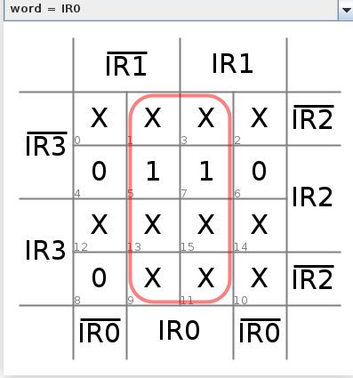

Only the load and store instructions care about this signal. This means that this result is acceptable:

    0110
    0110
    0110
    0110

It has "1" everywhere it needs to and "0" in the places that they are needed. Just connecting *word* to
IR[0] would solve this. It is important to check that *fetch* doesn't need something different. In this
case there is no problem since the data fetched from memory is stored directly in *IR* without passing
though the byte adaptation circuit.

Another example is *sub*. It is needed not only for **SUB** but also for generating the correct value
for **SLT** and the branch instructions. But we need addition for jumps and memory transfer, as well
as for **ADD** itself:

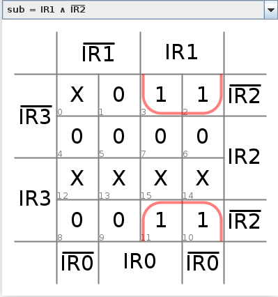

We never want subtractions in *fetch*, so `sub := EXECUTE & !IR[2] & IR[1]` will do the job, which is a three input
NAND gate with one inverted input. To make it shorter, this could be expressed as `E&!IR2&IR1`. The expressions for
some more signals can be derived in the same way:

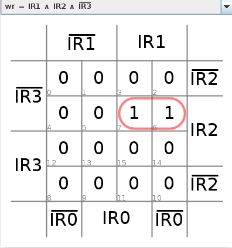 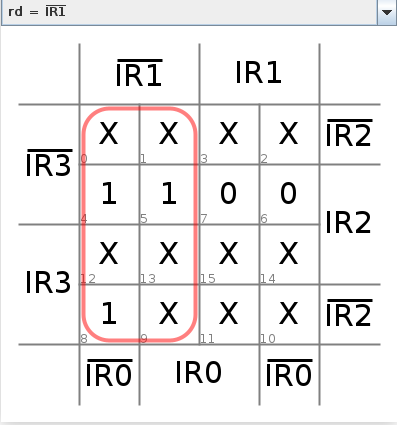 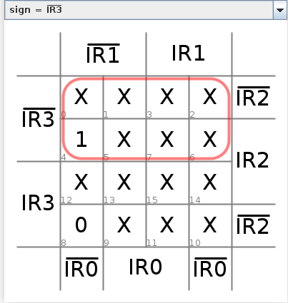 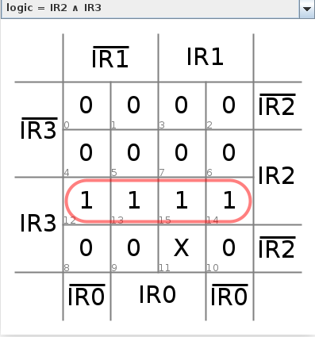

*logSelect* is simply the low two bits of the instruction.

For the two multiplexers at the input of the register file:

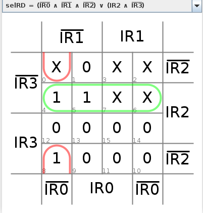 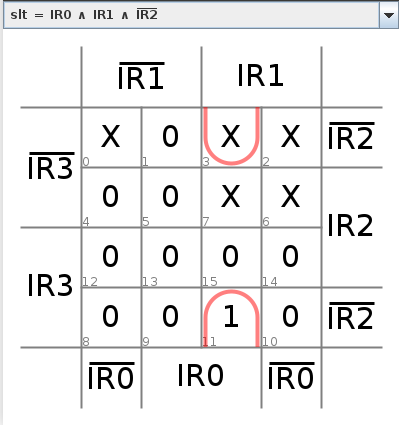

The complexity of this logic is a result of there not being a good place to include the **LBU** and
**SLT** instructions.

Branches are the only case when no register is written to as the result is saved in *cond* instead.
IR0 selects between *GE* amd *NE* inputs and *alt* inverts the test. *alt* is just the lowest bit
of the immediate value before it is optionally cleared by *even*. *we* is enabled except during the
execution of branches while *immLow* is enabled during the fetch of the instruction after a branch.

Fetches force rD to the *PC* while field rS1 is forced to the *PC* during the execution of a
jump or for fetches except after a branch.

## Software

It is possible to use the GNU AS assembler, even if it is for a processor like the x86, to generate
binaries for drv16. Macros and other definitions in *drv16.inc* allow any assembly program that
includes it to use all the instructions defined above. One limitation is that symbols can't be used
directly, so if a label `width` is defined somewhere its data must be read with `lh x4, zero, (width-absStart)`.
File *drv16.inc* defines `absStart` as address 0. The macro for pseudo instruction **LA** does this
internally.

A second limitation is that while the hardware does not require a prefix for memory and control flow
instructions that have immediate values of 15 or less, *drv16.inc* generates a useless 0x0000 prefix
anyway. A dedicated assembler doing more than one pass would typically make programs around 25% smaller
(which also eliminates clock cycles).

A bash script, *../as2hex* will transform an assembly source file *.S* into an Intel Hex equivalent
to the binary. Digital can load such files directly into a memory block before the start of a simulation.

The program *gcd.S* calculates the greatest common denominator between two numbers that are built into
the sources (currently 12 and 18). A message with the result and the two numbers is printed in the
terminal window. The code to print strings and decimal number (always 3 digits with leading zeros)
dwarfs the actual GCD part.

The program *testTerm.S* will eventually test all instructions and show the results in the terminal.
Currently only the *LI* (actually *ADDI*), *SH* and *J* (actually *JAL*) are being tested to print
a sequence of "5" characters to the terminal.