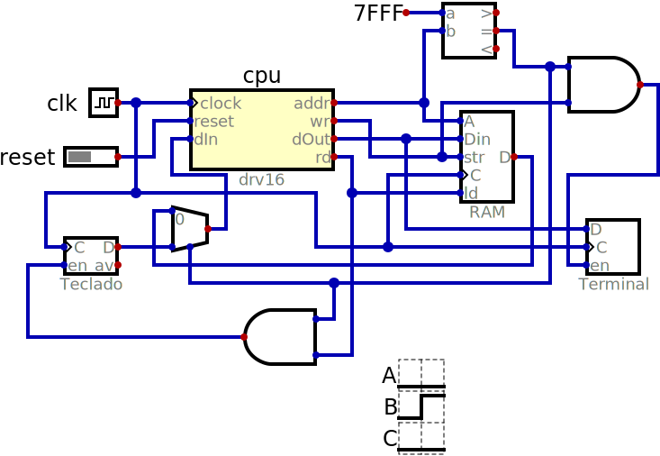

# drv16

The drv16 processor is based on the RISC-V standard but with only 16 registers
of 16 bits each. It implements fewer instructions than RV32E, but the ones it
does implement use the same mneomonic and have the same functionality.

The binary encoding of the instructions is 16 bits but is not compatible with the
RISC-V C extension. The most significant difference is the instruction which adds
12 bits to the 4 bit immediate value of the following instruction (it is treated
as a single 32 bit instruction).

All other instructions have the format:

| 15 14 13 12 | 11 10 09 08 | 07 06 05 04 | 03 02 01 00 |
|-------------|-------------|-------------|-------------|
| rD | rS1 | rS2 | operation |

Register x0 holds the current program counter (PC), but when the rD field is
zero no register is changed and when rS1 or rS2 are zero the value 0 is used
in place of whatever is in x0.

The normal fetch cycle execute the equivalent to a `@RI := mem[@PC := @PC + 2]`
instruction. Using a non latched memory (an option for BRAMs in some FPGAs and
how external SRAM chips work) all instructions can run in two clock cycles
(fetch and execute).

In the table below, **@rS2** indicates the 16 bit value in the register addressed
by the rS2 field of the instruction while a plain **rS2** indicates a 4 bit
immediate value extended to 16 bits from the start of a 32 bit instruction pair.
**rD** indicates a 4 bit immediate value that might be extended or not depending
on whether the previous instruction is par of a pair.

| operation | mnemonic | pseudo code |
|----------|----------|---------------|
| 0 |  | @IM := @IR, @IR := mem[@PC := @PC + 2] |
| 1 | AND | @rD := @rS1 & @rS2 |
| 1 | ANDI | @rD := @rS1 & (@IM \| rS2) |
| 2 | OR | @rD := @rS1 \| @rS2 |
| 2 | ORI | @rD := @rS1 \| (@IM \| rS2) |
| 3 | XOR | @rD := @rS1 ^ @rS2 |
| 3 | XORI | @rD := @rS1 ^ (@IM \| rS2) |
| 4 | JAL | @rD := @PC + 2. @IR := mem[@PC := @PC + (@IM \| rS2)] |
| 5 | ADD | @rD := @rS1 + @rS2 |
| 5 | ADDI | @rD := @rS1 + (@IM \| rS2) |
| 6 | SUB | @rD := @rS1 - @rS2 |
| 6 | SUBI | @rD := @rS1 - (@IM \| rS2) |
| 7 | SLT | @rD := @rS1 < @rS2 |
| 7 | SLTI | @rD := @rS1 < (@IM \| rS2) |
| 8 | JALR | @rD := @PC + 2. @IR := mem[@PC := @rS1 + (@IM \| rS2)] |
| 9 | LH | @rD := mem[@rS1 + (@IM \| rS2)] |
| A | LB | @rD := SignExtend(mem[@rS1 + (@IM \| rS2)]) |
| B | LBU | @rD := ZeroExtend(mem[@rS1 + (@IM \| rS2)]) |
| C | SH | mem[@rS1 + rD] := @rS2 |
| D | SB | mem[@rS1 + rD] := 8Bits(@rS2) |
| E | BEQ | @RI := mem[@PC := @PC + (@rS1 = @rS2?rD:2)] |
| E | BNE | @RI := mem[@PC := @PC + (@rS1 ~= @rS2?rD:2)] |
| F | BLT | @RI := mem[@PC := @PC + (@rS1 \< @rS2?rD:2)] |
| F | BGE | @RI := mem[@PC := @PC + (@rS1 \>= @rS2?rD:2)] |

Most instructions have two variations and the presence or not of the extension
selects between them. In the case of **BEQ** and **BNE** it is the least
significant bit of **rD** (extended or not) that selects between them as the
bit would otherwise be wasted since we can't branch or odd addresses.

drv16 has a **SUBI** instruction that RV32E lacks (since it can have negative
constants for **ADDI**). Missing are unsigned comparisons (**SLTIU**, **SLTU**,
**BLTU**, **BGEU**). Also missing are  **LUI** and **AUI** since constants larger than
12 bits are generated differently.

The hardware to implement shifts can be very large compared to the rest of the
processor, so the shift operations
 (**SLLI**, **SRLI**, **SRAI**,
**SLL**, **SRL**, **SRA**) were also omitted. But the `SLLI x3,x4,3` can be
implemented using the sequence 
`ADD x3,x4,x4. ADD x3,x3,x3. ADD x3,x3,x3`.  Right shifts are a lot more complicated,
but can also be implemented using macros.

**ECALL** in **EBREAK** are the two remaining RV32E instructions missing from drv16.

## Implementation

The project *system.dig* includes the drv16 processor connected to an asynchronous RAM
with 32K words of 16 bits each. Address 0xFFFE (word address 0x7FFF) is also mapped
to the terminal.

The processor, *drv16.dig*, currently implements a trivial test: it is always accessing the terminal
address and the reset input (a button on the top level) is used to write the character
'5' to the terminal. The goal was mainly to check that the memory and terminal work,
including that *gcd.hex* is correctly loaded into the memory before the simulation with
no endian problems.
